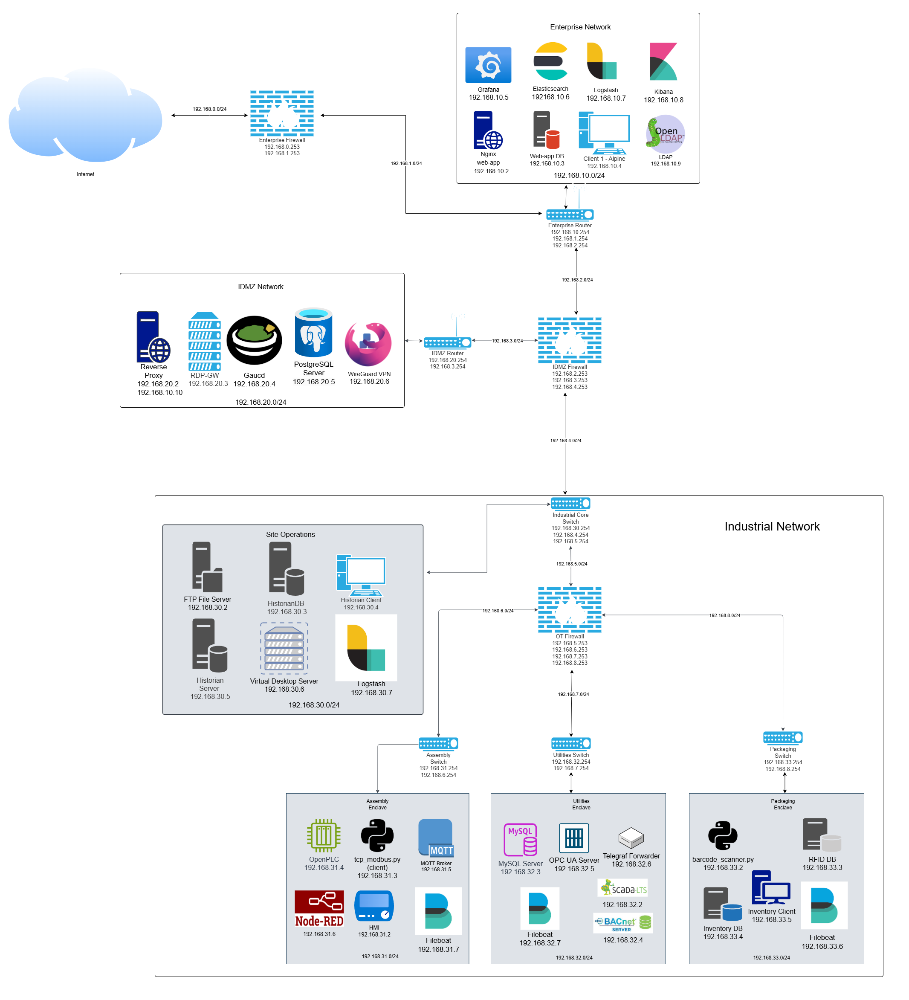

[](https://github.com/lucasdbrown/industrial_network_template/actions/workflows/docker-checks.yml)
# Industrial Virtualized Network Template
Simulated Industrial Network Template for OT Security Competitions or Projects


## Setting up your own Industrial Network
- git clone the repo and then remove the `.git` directory with `rm -rf .git`
- Then do the process of starting the new repo:
-  `git init`
-  `git add .`
-  `git commit -m "New Repo"`

## Running or Testing the OT Network
```bash
chmod +x testing.sh
./testing.sh
```
Look through `/docs/scripts.md` for documentation on the scripts in this repo

## For documentation 
- Go to the `docs` folder 

## Diagram of OT Network



## Guide for how to make your own Industrial Network using this template
- Add components/services and add their configurations to the `docker-compose.yml` in the folder where your components/services are
- Use the scenario template below

#### Scenario Template for Planning what to add to the Industrial Network Template
- Foothold: 
  - Is there a Vendor Foothold?
    - Do you need to create a Vendor Network and gain access to the Industrial Network through a Vendor RDP access?
- Added Services to Enterprise:
- Added Services to IDMZ:
- Added Services to Industrial:
- Enclaves:
- Industrial Processes:
- Most Critical Parts of the Industrial Process to Exploitation/Manipulation:


## Credit
- Couldn't have made this without the creation of Virtue Pot by Nikhil Karakuchi (https://github.com/0xnkc/virtuepot/), you can find his Master's Thesis paper on VirtuePot here: https://thesis.unipd.it/handle/20.500.12608/71043
- As well as the diagrams throughout the Industrial Cybersecurity (Second Edition) book by Pascal Ackerman & Packt
